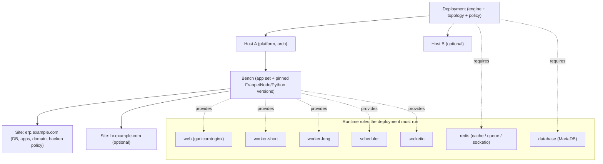
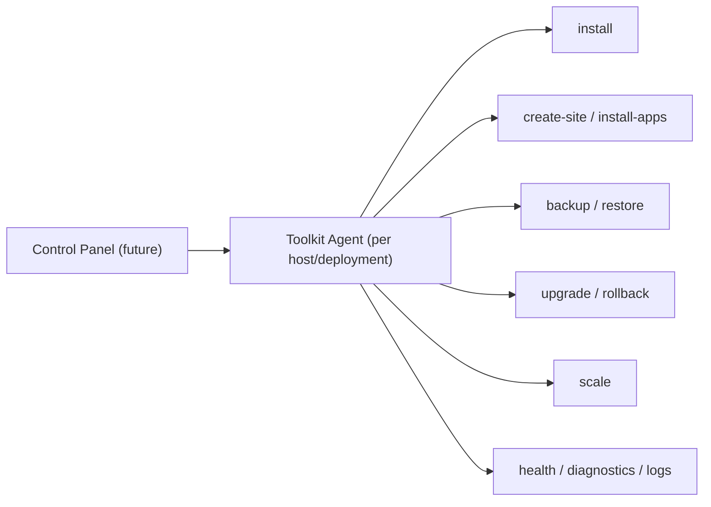

# ERPNext Developer Toolkit — Deployment Architecture

**Status:** Architecture of record (design document) · **Applies from:** v1.10.x onward
**Related:** [`ROADMAP.md`](ROADMAP.md) · [`CHANGELOG.md`](CHANGELOG.md) · [`lib/engine.sh`](lib/engine.sh) · [`lib/docker.sh`](lib/docker.sh)

---

## 1. Purpose & non-goals

This document defines the *conceptual model* the toolkit uses to reason about
ERPNext/Frappe deployments — from a single laptop VM to a horizontally scaled,
multi-server production estate — and the **phased, risk-gated roadmap** for
growing into that model.

It exists so that the vocabulary (benches, sites, runtime roles, deployments,
topologies) is settled **before** any v2.0 code work, and so that today's
single-node install can adopt that vocabulary with **zero behavior change**.

### Non-goals

- This is **not** a commitment to build multi-server tiers (B–D below) on any
  particular timeline. Those are gated behind explicit phases and re-evaluated
  when the single-node foundation is solid.
- This does **not** change any runtime behavior, command, wizard flow, or
  release. It is documentation only.
- The **single-admin, single-node local-dev experience is the product's center
  of gravity** (rated 9.5/10 today). Nothing in the richer model may regress
  that. "Single-server deployment" must remain the one-keystroke default in
  every guided flow.

---

## 2. Core model: benches, sites, runtime roles, deployments — not apps as services

The single most important architectural decision: **do not model individual
Frappe apps as independent server services.** Apps are code that lives inside a
bench; they are not deployable units on their own. Model the four things Frappe
itself models:

| Entity | What it is | Key attributes |
|--------|-----------|----------------|
| **Deployment** | A logically independent ERPNext estate under one lifecycle/backup/upgrade policy. | engine, topology, owning operator |
| **Host** | A machine (VM/container host/node) that runs one or more runtime roles. | platform (OS), arch, address |
| **Bench** | An app set with pinned Frappe + dependency versions. Sites are created inside a bench. | app set, Frappe version, Node/Python/bench versions |
| **Site** | A single tenant: its own database, installed apps, domain, and backup policy. | database, apps installed, domain, backup policy |
| **Runtime role** | A process class the deployment must run. | `web`, `worker-short`, `worker-long`, `scheduler`, `socketio`, `redis`, `database` |

Consequences of this model:

- **Different app sets → different benches.** Apps that need different Frappe
  versions or that shouldn't share a Python/Node environment belong in separate
  benches.
- **Strong operational isolation → different deployments.** When two workloads
  must scale, back up, or upgrade independently, they are separate deployments,
  not just separate sites.
- **Same site at higher scale → replicate the same compatible bench/app set**
  across application hosts, connected to shared data/file infrastructure.
- **Heavy workload → split runtime roles** (web/workers/scheduler/socketio vs.
  database vs. Redis) across hosts.
- **Very large → orchestrator** (see §6).

In **single-node** deployments, every runtime role is co-located on one host and
one bench holds one site — but the entities above still describe it exactly (see
§4). That is what makes the model adoptable today without new code.

---

## 3. Dimensions

A deployment is described by four dimensions. They are presented as an
orthogonal decomposition for clarity, **but they are not fully independent** —
see the coupling note below.

### Engine — *how* the stack runs

| Engine | Status | Description |
|--------|--------|-------------|
| `native` | shipped (default) | ERPNext/Frappe installed directly on the host: Supervisor/Gunicorn/workers/scheduler + host MariaDB/Redis/Nginx. |
| `docker` | shipped (v1.10.0) | Containerized stack wrapping the official [`frappe_docker`](https://github.com/frappe/frappe_docker) (`pwd.yml` + generated override). |
| `orchestrator` | **documented future** | Wraps Frappe's official [Helm chart](https://github.com/frappe/helm) on Kubernetes. See §6. |

### Platform — *where* it runs

| Platform | Native engine | Docker host |
|----------|:-------------:|:-----------:|
| Ubuntu 24.04 LTS | ✅ | ✅ |
| Ubuntu 26.04 LTS | ✅ | ✅ |
| Debian 13 (trixie) | ✅ | ✅ |
| Debian 11 / 12 | — | ✅ |

### Topology — *how many hosts and how roles are distributed*

| Topology | Shape | Tier |
|----------|-------|:----:|
| `single-node` | All roles + bench + site on one host. | A |
| `split-app-db` | Application host(s) + dedicated database host; backup/object storage. | B |
| `horizontally-scaled` | Load balancer + 2+ identical app hosts + shared DB + shared file storage + external Redis. | C |
| `clustered` | Multiple proxies/LB, separate worker pools, schedulers, socketio tier, HA DB, shared/object storage, central monitoring/logs, automated deploys. | D |

### App topology — *how app sets and sites are grouped*

| App topology | Meaning |
|--------------|---------|
| `single-bench` | One bench, one or more sites sharing the same app set/versions. |
| `multi-bench` | Multiple benches on the same deployment for incompatible app sets/versions. |
| `multi-deployment` | Different app sets/sites on separate deployments for independent scaling/isolation. |

### Orthogonality caveat

Engine and topology are **coupled at the high end**. `clustered` (Tier D)
effectively *implies* the `orchestrator` engine — hand-building HA across the
native Supervisor+Nginx model over SSH is not realistically maintainable, and
`horizontally-scaled` (Tier C) is practical mainly on Docker Swarm/Kubernetes.
So the valid combinations narrow as scale grows; the wizard should present
topology choices filtered by the selected engine rather than treating all
combinations as available.

---

## 4. Single-node as the degenerate case

The current single-VM install *is* the model with every collection reduced to a
single element:

| Model entity | Single-node reality today |
|--------------|---------------------------|
| Deployment | One deployment (`native` engine, `single-node` topology). |
| Host inventory | One host (this VM). |
| Bench | One bench (`BENCH_DIR`). |
| Site | One primary site (`SITE_NAME`). |
| Runtime roles | All roles co-located: Supervisor-managed web/workers/scheduler/socketio + host MariaDB + host Redis. |
| App topology | `single-bench`. |

This proves the vocabulary can be adopted immediately as documentation and
config semantics **without** introducing remote transport, inventory, or
distributed state. Multi-host concepts stay dormant until a later phase promotes
"host inventory" from "one implicit host" to "an explicit list."

---

## 5. Lifecycle / engine contract

Every engine exposes the same **engine- and topology-agnostic verb set**. This
verb set is also the future control-plane/agent command surface (§8).

| Verb | Meaning | Today in [`lib/engine.sh`](lib/engine.sh) |
|------|---------|-------------------------------------------|
| `install` | Provision the deployment. | `engine_install` |
| `status` | Report runtime state. | `engine_runtime_status` |
| `health` | Readiness/liveness probe. | `engine_ready` |
| `logs` | Stream/inspect logs. | `engine_runtime_logs` |
| `start` / `stop` / `restart` | Runtime lifecycle. | `engine_runtime_start` / `_stop` / `_restart` |
| `bench` | Run a bench command in the right context. | `engine_bench` |
| `backup` | Take a site backup. | `engine_backup` |
| `site-url` | Resolve the site's access URL. | `engine_site_url` |
| `restore` | Restore a site from backup. | **gap** — command exists, not engine-dispatched |
| `upgrade` | Upgrade bench/apps/stack. | **gap** — not a first-class engine verb |
| `rollback` | Revert a failed upgrade. | **gap** |
| `diagnostics` | Structured doctor/support bundle. | **gap** — `doctor` is engine-aware but not a contract verb |
| `scale` | Adjust role replica counts. | **gap** — meaningful only for Tier C/D engines |

The near-term, low-risk work is to **close the contract gaps for the two shipped
engines** (native, docker) before adding any new engine or topology — i.e.
promote `restore`/`upgrade`/`rollback`/`diagnostics` to first-class
`engine_*` verbs so both engines answer the full contract uniformly. `scale`
stays a no-op/`unsupported` on single-node engines until an orchestrator engine
exists.

---

## 6. HA / cluster = a wrapped orchestrator engine (not hand-built)

Tiers C and (especially) D should **not** be built as bespoke multi-node
orchestration inside the toolkit. Instead, add an `orchestrator` engine that
**wraps Frappe's official Helm chart** on Kubernetes — mirroring exactly how the
`docker` engine wraps upstream `frappe_docker` today (see [`lib/docker.sh`](lib/docker.sh)).

Rationale:

- Frappe's Helm chart already separates web, scheduler, socketio, and worker
  roles and supports horizontal autoscaling for several process types. Wrapping
  it inherits upstream's correctness and maintenance.
- It keeps the toolkit's value where it belongs — a **unified operator
  experience and lifecycle contract** across engines — rather than reinventing a
  distributed control plane in bash.
- It matches the proven pattern: the Docker engine's success came from wrapping
  `frappe_docker`, not from re-implementing containerization.

Under this framing, `clustered` topology is realized *by selecting the
orchestrator engine*, and the toolkit's job is to translate the same lifecycle
verbs (§5) into Helm/`kubectl` operations.

---

## 7. Compatibility-driven app grouping (advisory)

App grouping recommendations should be **compatibility-driven, not
hard-coded**. The toolkit already tracks per-app branches and validates them
against the detected ERPNext/Frappe major version (see the app compatibility
logic in [`lib/apps.sh`](lib/apps.sh), e.g. `APP_COMPAT_*`). Formalize this as an
advisory matrix that a future "what apps do you need?" wizard consults:

| App | Grouping guidance | Basis |
|-----|-------------------|-------|
| ERPNext + HRMS | Same deployment / same bench. | Closely integrated; shared Frappe version line. |
| Frappe CRM | Same compatible bench **or** separate deployment with API integration. | Standalone app; ERPNext already has classic CRM. |
| Helpdesk | Separate deployment when independent scaling/operational isolation is wanted; pulls the Telephony dependency. | Independent lifecycle; has its own dependency. |
| Education / LMS / Wiki / Drive / etc. | Group when version-compatible; isolate when scaling or blast-radius differ. | Version-major match + operational isolation. |

Key properties that make this a **low-risk early win**:

- It is **static advisory data + version checks**, fully decoupled from any
  multi-node/topology work.
- It can ship independently and immediately improves the single-node experience.
- Recommendations are derived from compatibility (Frappe major version, declared
  dependencies) rather than baked-in assumptions.

---

## 8. Control-plane / agent vision

The lifecycle contract in §5 is deliberately the same verb set a future
**control panel** would issue to a per-host **agent**:

This reinforces the sequencing already chosen: **build the CLI toolkit and its
engine contract first**; the agent is that same contract exposed over a
transport, and the panel is a client of the agent. The panel/agent are an
explicit **v2+ / separate-product** concern — listed here only to confirm the
contract we design today is the right long-term surface. Frappe Cloud's own
agent/control-plane split (proxy / app / database servers driven by
programmatic jobs) is the reference shape.

---

## 9. Phased, risk-gated roadmap

Each tier is gated on the previous one being solid. Risk ratings reflect the
current codebase, whose engine contract is **entirely single-node** today (local
execution, one bench, one site, flat `/etc/erpnext-dev/config.env`).

| Tier | Topology | Risk | Why | Gate to enter |
|:----:|----------|:----:|-----|---------------|
| **A** | `single-node` | **LOW** | Essentially what exists; adopt vocabulary + close contract gaps (§5) with no behavior change. | — (current) |
| **B** | `split-app-db` | **MEDIUM–HIGH** | New remote-execution/transport layer + secure inter-node networking + remote DB provisioning. | Full contract closed for native+docker; transport design reviewed. |
| **C** | `horizontally-scaled` | **HIGH** | Load balancer + shared filesystem + external Redis + multi-host orchestration; realistic only on Swarm/K8s. | Orchestrator engine exists (§6). |
| **D** | `clustered` | **LOW–MEDIUM if wrapping Helm; VERY HIGH if hand-built** | HA DB, worker pools, socketio tier, central monitoring/logs, automated deploys. | Orchestrator engine mature; positioning expanded beyond single-admin. |

### Guiding principle

**Single-node first; wrap an orchestrator for HA.** Grow the model by (1)
adopting the vocabulary and closing the lifecycle contract on the two shipped
single-node engines, then (2) introducing multi-host only behind a transport
layer, and (3) reaching HA/cluster by *wrapping* the official Helm chart rather
than hand-building distributed orchestration. Never regress the single-node
local-dev default in the process.

### Positioning note

Tiers C/D imply a multi-server / SRE operator profile that is broader than the
current, deliberately scoped **single-admin dedicated VM** positioning (see
[`ROADMAP.md`](ROADMAP.md)). Advancing past Tier B is therefore a **strategic
product decision**, not merely a technical milestone.
