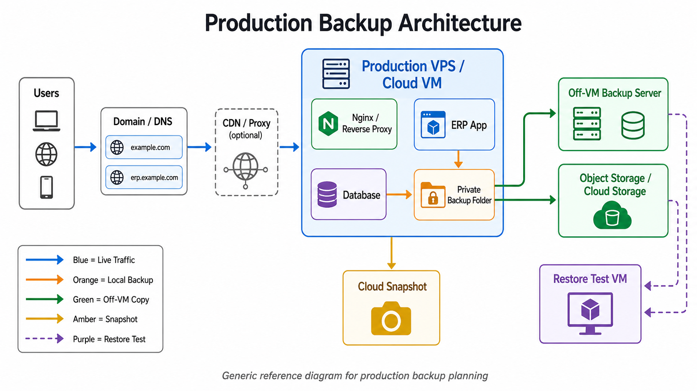
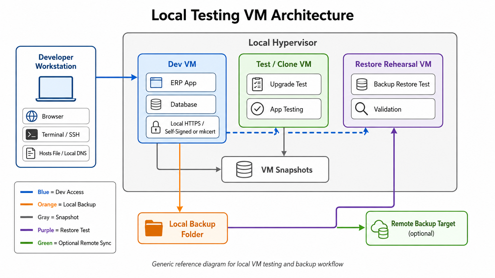

## Support bundle audit and package validation

v1.1.73 adds a `support-bundle-audit` command and exposes it in **Production Operations > Support and Diagnostics**. The audit checks the latest support bundle, or an archive supplied through `SUPPORT_BUNDLE_AUDIT_ARCHIVE`, for forbidden backup/credential filenames and obvious unredacted secret patterns before the bundle is shared. It is a best-effort safety check and does not replace manual review.

## Release manifest, expanded checksums, and quality assessment

v1.1.74 adds [`QUALITY-ASSESSMENT.md`](QUALITY-ASSESSMENT.md), [`RELEASE-MANIFEST.txt`](RELEASE-MANIFEST.txt), and expanded release validation.

## Modularization and shellcheck

v1.1.75 begins careful modularization by extracting shared helpers into [`lib/common.sh`](lib/common.sh). v1.1.76 extracts support and diagnostics into [`lib/support.sh`](lib/support.sh). v1.1.77 extracts backup and restore workflows into [`lib/backup.sh`](lib/backup.sh). v1.1.78 extracts SSL/HTTPS and firewall helpers into [`lib/ssl.sh`](lib/ssl.sh) and [`lib/firewall.sh`](lib/firewall.sh). v1.1.79 extracts curated app installation into [`lib/apps.sh`](lib/apps.sh). v1.1.80 extracts health monitoring and go-live readiness into [`lib/health.sh`](lib/health.sh). GitHub Actions CI runs `scripts/run-shellcheck.sh` before `scripts/validate-release.sh`.

```bash
scripts/validate-release.sh
scripts/generate-release-checksums.sh
scripts/run-shellcheck.sh
```

`SHA256SUMS` covers `erpnext-dev.sh`, `lib/common.sh`, release validation scripts, and `RELEASE-MANIFEST.txt`. Validation checks version consistency, manifest entries, support-bundle audit fixtures, and menu smoke tests when passwordless sudo is available.

```bash
sudo erpnext-dev support-bundle
sudo erpnext-dev support-bundle-audit
```

`scripts/validate-release.sh` now includes a clean support-bundle fixture audit so the release package catches regressions in the audit command before a tag is published.

## Release validation and CI

v1.1.72 adds a minimal release validation layer:

```bash
scripts/validate-release.sh
```

The script checks Bash syntax, toolkit version output, `SHA256SUMS`, help output for key commands, `verify-toolkit` active checksum matching, absence of `GITHUB-UPDATE-v*.md` files, and a basic secret-pattern scan. The GitHub Actions workflow at `.github/workflows/ci.yml` runs the same script on pushes, pull requests, and version tags.

# ERPNext Developer Toolkit


A guided installer and operations toolkit for ERPNext/Frappe on Ubuntu and Debian-family VMs.

To check the installed toolkit version, run:

```bash
erpnext-dev version
```

It supports two main setup paths:

- **Local development VM** using a local test hostname such as `erp.test`.
- **Public VPS / cloud VM** using a real domain or subdomain such as `erp.example.com`.

The project also includes production operations helpers for SSL, firewall hardening, scheduled backups, backup retention, off-VM backup planning, health checks, restore preflight, optional app installation, diagnostics, support bundles, and safe maintenance workflows.

The day-to-day menu exposes **Local VM HTTPS / SSL**, **Production HTTPS / SSL**, and **Optional apps** as first-level actions after installation.

Interactive menus use a shared navigation reader: `q`/`Q` quits, `b`/`B` goes back where supported, and `sudo erpnext-dev menu-self-test` validates the menu navigation paths without running destructive actions.

When running an interactive menu command such as `sudo erpnext-dev final-qa`, run it by itself. Do not paste additional commands after it in the same shell block unless you want those commands to run after you quit the menu.

> Version history is maintained in [`CHANGELOG.md`](CHANGELOG.md). This README intentionally focuses on current installation, operations, and usage.
>
> Security posture, threat model, and release-trust work are tracked in [`SECURITY.md`](SECURITY.md). Release reliability, CI, checksum, and modularization planning are tracked in [`RELIABILITY-PLAN.md`](RELIABILITY-PLAN.md).
>
> Preferred bootstrap method: use a pinned release tag plus `SHA256SUMS` verification before running the toolkit with `sudo`. The `main` branch raw URL is now treated as a development convenience path, not the recommended production bootstrap path.

---

## Start here

Copy one command into a fresh **Debian-family Linux VM** such as Ubuntu or Debian. The VM needs `sudo` access and internet access.

Most users should start with the **general guided setup** because it lets them choose local or production from the installer menu.

### Verified release bootstrap

v1.1.74 adds [`QUALITY-ASSESSMENT.md`](QUALITY-ASSESSMENT.md), [`RELEASE-MANIFEST.txt`](RELEASE-MANIFEST.txt), and expanded release validation. v1.1.75 extracts shared helpers into `lib/common.sh` and adds shellcheck to CI.

The current `SHA256SUMS` file verifies the `erpnext-dev.sh` file for that release tag. Future releases may add a broader package checksum workflow and GPG-signed releases for stronger maintainer identity verification.

### General guided setup — choose local or production

```bash
sudo apt-get update && sudo apt-get -y upgrade && sudo apt-get install -y curl ca-certificates
VERSION="v1.1.80"
curl -fsSLO "https://raw.githubusercontent.com/ReyadWeb/erpnext-dev-installer/${VERSION}/erpnext-dev.sh"
curl -fsSLO "https://raw.githubusercontent.com/ReyadWeb/erpnext-dev-installer/${VERSION}/SHA256SUMS"
sha256sum -c SHA256SUMS
chmod +x erpnext-dev.sh
sudo ./erpnext-dev.sh start-here
```

Use this when you want the toolkit to ask which path to follow. The wizard offers:

```text
1) Local development VM
2) Public VM / production-candidate
3) Existing install / maintenance menu
```

Site name guidance after the command:

```text
Local VM default:        erp.test
Production example:     erp.example.com
```

For local VMs, the installer prints the correct host `/etc/hosts` command using the VM IP it detects on that machine. Do not copy another user's sample IP.

### Local VM install

```bash
sudo apt-get update && sudo apt-get -y upgrade && sudo apt-get install -y curl ca-certificates
VERSION="v1.1.80"
curl -fsSLO "https://raw.githubusercontent.com/ReyadWeb/erpnext-dev-installer/${VERSION}/erpnext-dev.sh"
curl -fsSLO "https://raw.githubusercontent.com/ReyadWeb/erpnext-dev-installer/${VERSION}/SHA256SUMS"
sha256sum -c SHA256SUMS
chmod +x erpnext-dev.sh
sudo ./erpnext-dev.sh local-dev-quickstart
```

Use this inside a local VM for development, testing, or app evaluation. The wizard asks for the local domain near the beginning. Press **Enter** to use:

```text
erp.test
```

After the local install finishes, the toolkit prints the direct IP URL, the friendly local URL, and a required host mapping checkpoint before local HTTPS. The most common follow-up commands are:

```bash
sudo erpnext-dev local-host-checkpoint
sudo erpnext-dev local-ssl-wizard
sudo erpnext-dev local-domain-status
sudo erpnext-dev local-access-doctor
sudo erpnext-dev local-fixed-ip-guide
```

Run the printed `/etc/hosts` command on the **host machine**, not inside the VM. It is safe to repeat because the command backs up `/etc/hosts`, removes only the old entry for the selected local domain, and adds the current VM IP. Then run the local SSL wizard when HTTP access is confirmed.

### Production VPS / cloud VM install

```bash
sudo apt-get update && sudo apt-get -y upgrade && sudo apt-get install -y curl ca-certificates
VERSION="v1.1.80"
curl -fsSLO "https://raw.githubusercontent.com/ReyadWeb/erpnext-dev-installer/${VERSION}/erpnext-dev.sh"
curl -fsSLO "https://raw.githubusercontent.com/ReyadWeb/erpnext-dev-installer/${VERSION}/SHA256SUMS"
sha256sum -c SHA256SUMS
chmod +x erpnext-dev.sh
sudo ./erpnext-dev.sh public-vm-guided-setup
```

Use this inside a fresh public VM when you have a real domain or subdomain ready. This command runs the guided production flow; the manual production menu remains available with `sudo erpnext-dev public-vm-quickstart`.

During the production HTTPS step, the guided setup recommends **Let's Encrypt** by default when DNS points directly to the VM. The user can still choose the advanced SSL provider wizard from that step, including **Cloudflare Origin CA** for Cloudflare-proxied Full (strict) deployments.

**v1.1.56 Cloudflare note:** when a Cloudflare record is orange-cloud/proxied, public DNS returns Cloudflare edge IPs instead of the VPS origin IP. That is expected for Cloudflare Origin CA. The guided setup now asks whether to stop for DNS-only/gray-cloud Let's Encrypt or continue with the Cloudflare proxied / Origin CA path. Only continue with the Cloudflare path when the hidden Cloudflare A-record content points to the VPS IP and Cloudflare SSL/TLS will be set to Full (strict).

**v1.1.57 validation note:** Cloudflare Origin CA / Full (strict) was validated on the real Hetzner VPS path. Expected passing status is Cloudflare-proxied DNS returning Cloudflare edge IPs, Cloudflare Origin CA active on the VM, `cloudflare-origin-ssl-status` showing `HTTP/2 200`, and direct backend ports `8000` and `9000` blocked externally.

### Guided off-VM backup server setup

**v1.1.59 backup note:** the toolkit supports a two-server off-VM backup setup and now provides safer, lower-input prompts. The backup-server wizard reminds the user to generate the ERPNext-side public key first, suggests a detected Hetzner volume path such as `/mnt/HC_Volume_.../erpnext-backups`, and can infer the site/domain folder from the generated key comment when the site prompt is left blank.

The target must be outside the ERPNext VM/account to protect against VM or disk loss.

Recommended order:

1. On the ERPNext VPS, generate the dedicated public key and copy the single `ssh-ed25519 ...` public key line:

```bash
sudo erpnext-dev generate-off-vm-backup-key
```

2. On the separate backup server, run the backup-server setup and paste that public key when prompted:

```bash
sudo apt-get update && sudo apt-get install -y curl ca-certificates
VERSION="v1.1.80"
curl -fsSLO "https://raw.githubusercontent.com/ReyadWeb/erpnext-dev-installer/${VERSION}/erpnext-dev.sh"
curl -fsSLO "https://raw.githubusercontent.com/ReyadWeb/erpnext-dev-installer/${VERSION}/SHA256SUMS"
sha256sum -c SHA256SUMS
chmod +x erpnext-dev.sh
sudo ./erpnext-dev.sh backup-server-setup
```

The backup-server setup creates/uses a backup user, prepares the backup folder, installs the ERPNext VM public key when provided, and prints the rsync target URI to use on the ERPNext VPS. Press **Enter** to accept suggested values when they are correct.

Typical backup-server prompts:

```text
Backup Linux user: erpbackup
Backup root folder: /mnt/HC_Volume_<id>/erpnext-backups
ERPNext site/domain folder: erp.example.com
Restrict SSH key to ERPNext VM source IP: <ERPNext VPS public IP>
Public key: ssh-ed25519 ... erpnext-offvm-backup-erp.example.com
```

3. Back on the ERPNext VPS, configure the target and validate:

```bash
sudo erpnext-dev off-vm-backup-guided-setup
sudo erpnext-dev off-vm-backup-dry-run
sudo erpnext-dev run-off-vm-backup
sudo erpnext-dev off-vm-backup-status
sudo erpnext-dev production-checklist
```

Keep `rsync --delete` disabled for the first validation run. Off-VM backup does not replace a restore rehearsal on a disposable VM.


Example production site name:

```text
erp.example.com
```

Before production HTTPS, make sure DNS points to the VM or your Cloudflare/proxy setup is ready. If DNS points directly to the VM, choose the default Let's Encrypt path. If the site will stay behind Cloudflare proxy, use the SSL provider wizard and choose Cloudflare Origin CA.

### Production validation stage

The completed local VM validation stage proves the `.test` local-development workflow, local HTTPS, optional apps, backups, restore, scheduled backups, retention checks, maintenance actions, Final QA, and support bundles.

The core production VPS guided path has also been validated on a fresh Hetzner VPS using Ubuntu 26.04 LTS, a real DNS record, Let’s Encrypt, Nginx, UFW, Fail2Ban, scheduled local backups, external backend-port blocking, browser login testing, and a redacted support bundle.

Cloudflare Origin CA / Full (strict): validated in v1.1.57 using Cloudflare orange-cloud/proxied DNS, Cloudflare Origin CA certificate/key on the VM, Nginx, external `HTTP/2 200` through Cloudflare, UFW production profile, Fail2Ban sshd jail, scheduled local backups, and external 8000/9000 blocking.

Validated production milestone:

```text
Toolkit: v1.1.53 core Let's Encrypt path; v1.1.56/v1.1.57 Cloudflare Origin CA path
Provider: Hetzner Cloud VPS
OS: Ubuntu 26.04 LTS
Domain test: real public subdomain
HTTPS: Let’s Encrypt directly on the VM; Cloudflare Origin CA / Full (strict) also validated
External result: HTTPS OK; public 8000/9000 blocked
Status: core production guided setup passed; both main production HTTPS paths validated
```

Remaining production hardening before real client go-live:

```text
Configure and test off-VM backups.
Rehearse restore on a disposable VM.
Cloudflare Origin CA / Full (strict) is validated. Keep using a fresh/rollback VPS for future SSL-path regression tests.
Optionally configure health timer/monitoring.
```

New release-validation stages should still use a **fresh disposable VPS with a real test subdomain** when validating production workflow changes. Do not use the already-tested local VM for production validation, and do not use a final client production server as the first test target.

Recommended production-validation prerequisites:

```text
Fresh Ubuntu 24.04 LTS or Ubuntu 26.04 LTS VPS
2 vCPU minimum; 4 vCPU preferred
4 GB RAM minimum; 8 GB preferred
60-80 GB SSD minimum
Public IPv4
Real test subdomain, for example erp-test.example.com
DNS A record pointing to the VPS public IP
Cloud firewall access
Snapshot capability
SSH access from your admin IP
```

Initial cloud firewall baseline before running the production quickstart:

```text
22/tcp    allow from admin IP only
80/tcp    allow from anywhere
443/tcp   allow from anywhere
8000/tcp  block from anywhere
9000/tcp  block from anywhere
```

If using Cloudflare, start with **DNS only** for the first Let's Encrypt validation. After the plain public HTTPS path works, test Cloudflare proxy / Full strict as a separate validation path.


### Troubleshooting: SSH host key changed after rebuilding a VPS

If you rebuild, reinstall, restore, or replace a VPS while keeping the same public IP or domain, your local computer may refuse SSH with this warning:

```text
WARNING: REMOTE HOST IDENTIFICATION HAS CHANGED!
Host key verification failed.
```

This is expected after an intentional fresh VPS rebuild because the new server has a new SSH host key. Only continue if you intentionally rebuilt the VPS or verified the server identity in your cloud provider console.

Run these commands on your **local/admin machine**, not inside the VPS:

```bash
ssh-keygen -f ~/.ssh/known_hosts -R "VPS_PUBLIC_IP"
ssh-keygen -f ~/.ssh/known_hosts -R "erp.example.com"
ssh root@VPS_PUBLIC_IP
```

Replace `VPS_PUBLIC_IP` and `erp.example.com` with your actual server IP and production domain. When SSH asks to trust the new fingerprint, type `yes` only after confirming this is your rebuilt VPS.

See [`PRODUCTION-VALIDATION.md`](PRODUCTION-VALIDATION.md) for the full VPS validation checklist and readiness ratings.

### Check the VM before installing

```bash
sudo apt-get update && sudo apt-get -y upgrade && sudo apt-get install -y curl ca-certificates
VERSION="v1.1.80"
curl -fsSLO "https://raw.githubusercontent.com/ReyadWeb/erpnext-dev-installer/${VERSION}/erpnext-dev.sh"
curl -fsSLO "https://raw.githubusercontent.com/ReyadWeb/erpnext-dev-installer/${VERSION}/SHA256SUMS"
sha256sum -c SHA256SUMS
chmod +x erpnext-dev.sh
sudo ./erpnext-dev.sh install-preflight
```

Use this when you only want to verify OS, internet access, CPU, RAM, disk, and temporary storage before starting the full install.

If the VM is clearly unsafe for ERPNext, the installer blocks the install and prints a red `INSTALL BLOCKED` summary explaining what to fix.

### Update or repair the `erpnext-dev` command

```bash
VERSION="v1.1.80"
curl -fsSLO "https://raw.githubusercontent.com/ReyadWeb/erpnext-dev-installer/${VERSION}/erpnext-dev.sh"
curl -fsSLO "https://raw.githubusercontent.com/ReyadWeb/erpnext-dev-installer/${VERSION}/SHA256SUMS"
sha256sum -c SHA256SUMS
chmod +x erpnext-dev.sh
sudo ./erpnext-dev.sh install-cli
erpnext-dev version
```

Use this on an existing VM to install, update, or repair the reusable toolkit command.

Then use the stable command:

```bash
sudo erpnext-dev menu
sudo erpnext-dev production-ops-wizard
```

### Optional apps wizard

```bash
sudo erpnext-dev app-install-wizard
sudo erpnext-dev app-status
```

Use this only after the core ERPNext install is healthy. The app status command shows installed site apps, downloaded app folders, uninstalled downloads, unregistered downloads, and curated optional-app status in one place.

The app wizard preflight separates installation state from branch safety. Installed apps can still show a branch note when they use `main`, `develop`, or the repository default branch. That is a repeatability warning, not an installation failure.

### Common follow-up commands

After the first quickstart or `install-cli` run, use `erpnext-dev` for normal operations:

```bash
erpnext-dev --help
erpnext-dev version
erpnext-dev where-installed
erpnext-dev verify-toolkit
sudo erpnext-dev menu
sudo erpnext-dev doctor --plain
sudo erpnext-dev verify-access
sudo erpnext-dev credentials-info
sudo erpnext-dev update-toolkit
sudo erpnext-dev repair-cli
```

### What the first command does

The long first-run command downloads a temporary bootstrap copy, runs it with `sudo`, then installs the stable toolkit command.

After the first run, the stable files are:

```text
Toolkit file:  /opt/erpnext-dev/erpnext-dev.sh
CLI command:   /usr/local/bin/erpnext-dev
Daily command: sudo erpnext-dev <command>
```

### Toolkit integrity verification

v1.1.71 adds an installed-file verification command:

```bash
erpnext-dev verify-toolkit
```

The command reports the active script path, stable toolkit path, CLI target, installed SHA256 values, and whether the active script matches `SHA256SUMS` when a checksum file is available.

The command looks for `SHA256SUMS` in the current directory, beside the active script, beside the stable toolkit path, or in `/opt/erpnext-dev`. You can also provide a file explicitly:

```bash
CHECKSUM_FILE=/path/to/SHA256SUMS erpnext-dev verify-toolkit
```

Use this after a tag-pinned verified update to confirm that the installed toolkit matches the published checksum.

The temporary file under `/tmp` is only used for the first bootstrap or update. It is not the long-term toolkit location.

---

## README menu

- [Start here](#start-here)
- [Architecture diagrams](#architecture-diagrams)
- [Quick decision guide](#quick-decision-guide)
- [Minimum VM expectations and blocking preflight](#minimum-vm-expectations-and-blocking-preflight)
- [Interactive menu navigation](#interactive-menu-navigation)
- [One-command local VM test](#one-command-local-vm-test)
- [One-command public VPS / cloud VM setup](#one-command-public-vps--cloud-vm-setup)
- [Reusable toolkit command](#reusable-toolkit-command)
- [Accessing ERPNext credentials](#accessing-erpnext-credentials)
- [Production operations](#production-operations)
- [Production operations dashboard](#production-operations-dashboard)
- [Health monitoring](#health-monitoring)
- [Go-live validation](#go-live-validation)
- [Validated production state](#validated-production-state)
- [Backups and restore safety](#backups-and-restore-safety)
- [Restore rehearsal from off-VM backup](#restore-rehearsal-from-off-vm-backup)
- [Pre-app checkpoint workflow](#pre-app-checkpoint-workflow)
- [Optional Frappe apps](#optional-frappe-apps)
- [SSL mode guide](#ssl-mode-guide)
- [Security hardening](#security-hardening)
- [Release security and reliability plans](#release-security-and-reliability-plans)
- [Diagnostics and support](#diagnostics-and-support)
- [Documentation files](#documentation-files)
- [Production caution](#production-caution)

---

## Architecture diagrams

### Production backup architecture



### Local testing VM architecture



---

## Quick decision guide

| Scenario | Command | Recommended hostname |
|---|---|---|
| VM safety check before install | `install-preflight` | not required yet |
| Local VM testing/dev | `local-dev-quickstart` | prompts; Enter defaults to `erp.test` |
| Public VPS/cloud VM | `public-vm-guided-setup` | `erp.example.com` |
| Existing install operations | `production-ops-wizard` | saved site/domain |
| Optional Frappe apps | `app-install-wizard` | existing site |
| Advanced custom app tools | `advanced-app-tools` | existing site |

Do not use a production domain for a local-only test VM unless you intentionally want that VM to act as a public deployment.

---

## Minimum VM expectations and blocking preflight

The installer includes a blocking install preflight so unsafe environments do not proceed into package installation, bench creation, or database changes.

Run it directly:

```bash
sudo "$tmp" install-preflight
```

or after the script has been copied to the reusable path:

```bash
sudo erpnext-dev install-preflight
```

Current safety behavior:

| Check | Behavior |
|---|---|
| Unsupported OS | blocks install |
| No sudo/root permission | blocks install |
| No GitHub/internet access | blocks install |
| CPU below 2 cores | blocks install |
| RAM below 4096 MB | blocks install |
| Root free disk below 30 GB | blocks install |
| `/tmp` free space below 4 GB | blocks install |
| RAM 4096-8191 MB | warning |
| CPU 2-3 cores | warning |
| Root free disk 30-59 GB | warning |

The install flow offers root storage expansion before the final blocking resource preflight when supported by the VM disk layout.

There is an expert-only unsafe override for disposable test VMs:

```bash
ERPNEXT_ALLOW_UNSAFE_INSTALL=true sudo "$tmp" local-dev-quickstart
```

Normal users should not use the unsafe override.

---

## Interactive menu navigation

Interactive menus use numbers for actions and letters for navigation:

```text
1) Run an action
2) Run another action
...
-----------------------------
b) Back                        q) Quit
```

Use:

```text
number = run the selected action
b or B = back to the previous menu
q or Q = quit the installer
```

The main menu shows only `q) Quit` because there is no parent menu to return to.

Some longer app menus use two columns when the terminal is wide enough, and fall back to one column when the terminal is too narrow.

---

## One-command local VM test

Run this inside a fresh local Ubuntu/Debian-family VM:

```bash
sudo apt-get update && sudo apt-get -y upgrade && sudo apt-get install -y curl ca-certificates
VERSION="v1.1.80"
curl -fsSLO "https://raw.githubusercontent.com/ReyadWeb/erpnext-dev-installer/${VERSION}/erpnext-dev.sh"
curl -fsSLO "https://raw.githubusercontent.com/ReyadWeb/erpnext-dev-installer/${VERSION}/SHA256SUMS"
sha256sum -c SHA256SUMS
chmod +x erpnext-dev.sh
sudo ./erpnext-dev.sh local-dev-quickstart
```

The quickstart installs the toolkit into the VM and creates the short command:

```bash
/opt/erpnext-dev/erpnext-dev.sh
/usr/local/bin/erpnext-dev
```

Use `sudo erpnext-dev` for follow-up commands, including SSL setup and optional app installation. Do not use `./erpnext-dev.sh` unless you are in the directory that contains the script.

Recommended local site name:

```text
erp.test
```

After the installer finishes, validate inside the VM:

```bash
sudo erpnext-dev version
sudo erpnext-dev doctor --plain
sudo erpnext-dev verify-access
sudo erpnext-dev access-info
sudo erpnext-dev backup-files
sudo erpnext-dev backup-status
sudo erpnext-dev backup-verify
sudo erpnext-dev credentials-info
```

For local VM domain access, print the required host-side mapping checkpoint from inside the VM:

```bash
sudo erpnext-dev local-host-checkpoint
sudo erpnext-dev local-domain-status
sudo erpnext-dev host-dns-guide
```

Run the printed `/etc/hosts` command on the **host machine**. This is safe to repeat after VM recreation or DHCP IP changes. Then test access from the host:

```bash
getent hosts erp.test
curl -I http://erp.test:8000
```

The VM IP is detected dynamically. Do not copy a sample IP from another machine.

If the VM is deleted and recreated, rerun `sudo erpnext-dev local-host-checkpoint` from inside the VM and apply the printed command on the host. This prevents `erp.test` from pointing to an old VM.

If local HTTPS is enabled, also test:

```bash
curl -Ik https://erp.test
```

For trusted local HTTPS with mkcert, use the guided setup inside the VM:

```bash
sudo erpnext-dev trusted-mkcert-setup
```

The wizard prints the HOST-side `mkcert` commands, checks whether the certificate/key were copied into `/tmp/` on the VM, and can install/configure/verify HTTPS when they are present. The full reference guide is still available:

```bash
sudo erpnext-dev mkcert-guide
```

The guide separates HOST commands from VM commands. In short: generate and trust the certificate on the Linux HOST, copy the cert/key into the VM with `scp`, then run the local SSL wizard inside the VM:

```bash
sudo erpnext-dev local-ssl-wizard
```

When the Local SSL Wizard is launched directly, `b`/`B` returns to the main menu. When it is launched from the Local VM HTTPS / SSL menu, `b`/`B` returns to that SSL menu.

After HTTPS is verified, continue with the safe local profile:

```bash
sudo erpnext-dev security-hardening-wizard
```

Choose `2) Local VM firewall profile`. Do not choose the production firewall profile for a local `erp.test` VM.

Expected local result:

```text
Install: OK
Runtime: Running via service
Site: erp.test
Direct URL: http://LOCAL_VM_IP:8000
Friendly URL: http://erp.test:8000
Local HTTPS: optional
```

Recommended local VM test order:

```text
1. local-dev-quickstart
2. doctor --plain
3. verify-access
4. backup-files
5. backup-verify
6. app-library / app-install-wizard only after core passes
7. install optional apps one at a time
8. reboot test
9. final doctor --plain and verify-access
```

---

## One-command public VPS / cloud VM setup

Run this inside a fresh public Ubuntu/Debian-family VM:

```bash
sudo apt-get update && sudo apt-get -y upgrade && sudo apt-get install -y curl ca-certificates
VERSION="v1.1.80"
curl -fsSLO "https://raw.githubusercontent.com/ReyadWeb/erpnext-dev-installer/${VERSION}/erpnext-dev.sh"
curl -fsSLO "https://raw.githubusercontent.com/ReyadWeb/erpnext-dev-installer/${VERSION}/SHA256SUMS"
sha256sum -c SHA256SUMS
chmod +x erpnext-dev.sh
sudo ./erpnext-dev.sh public-vm-guided-setup
```

Use a real subdomain, for example:

```text
erp.example.com
```

Typical guided public setup flow:

```text
1. Detect VPS/public IP
2. Ask for production domain and site name
3. Check DNS points to this VPS
4. Confirm cloud firewall baseline and clean provider snapshot
5. Install or repair ERPNext
6. Create and verify backup checkpoint
7. Configure production HTTPS; Let's Encrypt is the default when DNS points directly to the VM, but the SSL provider wizard can be opened for Cloudflare Origin CA
8. Apply production security profile and Fail2Ban
9. Configure scheduled backups and review off-VM backup plan
10. Optional apps, only if wanted
11. Production checklist, Final QA, support bundle, post-validation snapshot reminder
```

Guided production HTTPS choice:

```text
Default/recommended: Let's Encrypt when DNS resolves directly to the VM
Alternative: Cloudflare Origin CA when Cloudflare proxy will stay enabled with Full (strict)
```

For Cloudflare Origin CA mode:

```text
DNS record: Proxied / orange-cloud
SSL/TLS mode: Full (strict)
Origin certificate: installed on the VM
```

Helpful Cloudflare commands:

```bash
sudo erpnext-dev cloudflare-origin-guide
sudo erpnext-dev configure-cloudflare-origin-ssl
sudo erpnext-dev cloudflare-origin-ssl-status
```

For Let's Encrypt mode:

```text
DNS record: DNS-only / direct to VM
Port 80: reachable during certificate issuance
```

Helpful public SSL commands:

```bash
sudo erpnext-dev production-ssl-plan
sudo erpnext-dev production-ssl-wizard
sudo erpnext-dev production-ssl-status
```

After installation, validate:

```bash
sudo erpnext-dev release-readiness
sudo erpnext-dev production-checklist
sudo erpnext-dev backup-verify
sudo erpnext-dev support-bundle
```

From your workstation, replace `PUBLIC_VM_IP` with the public server IP:

```bash
curl -I https://erp.example.com
curl -I --connect-timeout 10 http://PUBLIC_VM_IP:8000
curl -I --connect-timeout 10 http://PUBLIC_VM_IP:9000
```

Expected public result:

```text
https://erp.example.com -> HTTP 200/redirect through Nginx/CDN/proxy
PUBLIC_VM_IP:8000 -> timeout or blocked
PUBLIC_VM_IP:9000 -> timeout or blocked
```

---

## Reusable toolkit command

The toolkit intentionally uses a temporary bootstrap file first, then a stable installed command:

```text
/tmp/erpnext-dev.XXXXXX.sh           temporary bootstrap copy created by mktemp
/opt/erpnext-dev/erpnext-dev.sh     stable root-owned toolkit file
/usr/local/bin/erpnext-dev              short command for daily use
```

Why `/tmp` first? The README one-liners download to a unique `mktemp` file under `/tmp` because it is writable by a normal sudo user and avoids modifying system-owned paths until the toolkit is actually executed with `sudo`. The `/tmp` copy should not be treated as permanent because `/tmp` may be cleaned by the OS.

Why `/opt` later? During quickstart, preflight, and CLI repair flows, the toolkit copies itself to:

```bash
/opt/erpnext-dev/erpnext-dev.sh
```

Then it creates the short command:

```bash
/usr/local/bin/erpnext-dev
```

Use `sudo erpnext-dev` for follow-up maintenance, backups, SSL, app installs, diagnostics, and production operations:

```bash
sudo erpnext-dev version
sudo erpnext-dev status
sudo erpnext-dev doctor --plain
sudo erpnext-dev verify-access
sudo erpnext-dev production-ops-wizard
```

To update or repair the toolkit command from a verified release tag:

```bash
VERSION="v1.1.80"
curl -fsSLO "https://raw.githubusercontent.com/ReyadWeb/erpnext-dev-installer/${VERSION}/erpnext-dev.sh"
curl -fsSLO "https://raw.githubusercontent.com/ReyadWeb/erpnext-dev-installer/${VERSION}/SHA256SUMS"
sha256sum -c SHA256SUMS
chmod +x erpnext-dev.sh
sudo ./erpnext-dev.sh install-cli
sudo erpnext-dev version
```

To check where the toolkit is installed:

```bash
erpnext-dev where-installed
```

---

## Accessing ERPNext credentials

After installation, the installer saves the generated ERPNext Administrator password and database credentials on the VM.

Use the safe overview command first. It shows where the credentials are stored, but it does **not** print passwords:

```bash
sudo erpnext-dev credentials-info
```

To display the generated password on a private VM console, use the guarded command below. It warns first and requires confirmation before printing secrets:

```bash
sudo erpnext-dev credentials-show
```

The ERPNext web login normally uses:

```text
Username: Administrator
Password: value shown by credentials-show
```

Check the credentials file owner and permissions:

```bash
sudo erpnext-dev credentials-file-status
```

Secure the credentials file with root-only permissions:

```bash
sudo erpnext-dev credentials-secure
```

After saving the credentials in a password manager or completing production handoff, remove the local plaintext credentials file:

```bash
sudo erpnext-dev credentials-delete
```

Reset the ERPNext Administrator password safely without manually changing directories or relying on the current user's `bench` PATH:

```bash
sudo erpnext-dev reset-admin-password
```

The credentials file is intentionally excluded from diagnostics, support bundles, shared logs, and generated support archives. Do not paste credentials into public tickets, GitHub issues, screenshots, or support chats.

---

## Production operations

Open the production operations dashboard:

```bash
sudo erpnext-dev production-ops-wizard
```

Equivalent aliases:

```bash
sudo erpnext-dev production-ops-dashboard
sudo erpnext-dev operations-dashboard
sudo erpnext-dev ops-dashboard
```

v1.1.66 turns this command into the main operator entry point for an existing production VM. It shows a compact current-state summary first, then groups mature commands into clear sections so the operator does not need to memorize individual command names.

Common direct operations commands remain available:

```bash
sudo erpnext-dev release-readiness
sudo erpnext-dev production-checklist
sudo erpnext-dev health-monitoring-wizard
sudo erpnext-dev health-check
sudo erpnext-dev configure-health-check-timer
sudo erpnext-dev health-check-status
sudo erpnext-dev health-check-journal
sudo erpnext-dev service-recovery-plan
```

Health checks cover ERPNext runtime, Nginx, MariaDB, Redis, HTTPS, disk usage, latest backup state, UFW, Fail2Ban, scheduled backup timer, and off-VM backup state.

---

## Production operations dashboard

The v1.1.67 dashboard is designed for day-to-day production administration after the VM is installed and validated. v1.1.67 adds navigation polish on top of the v1.1.66 dashboard: the direct top-level dashboard shows only `q) Quit`, while nested operator sections keep `b) Back` and `q) Quit`. v1.1.68 records the completed production validation evidence for that dashboard polish.

It starts with a status overview similar to:

```text
Runtime
Install
HTTPS
Security
Local backup
Off-VM backup
Restore rehearsal
Health monitoring
Go-live validation
```

Then it provides these operator sections:

```text
1) System health and readiness
2) Services and recovery
3) Local backups
4) Off-VM backups
5) Restore readiness and rehearsal
6) Health monitoring
7) Security and firewall
8) HTTPS and certificates
9) Go-live validation
10) Support and diagnostics
11) Final QA
```


Navigation behavior:

```text
Top-level dashboard:             q) Quit
Nested dashboard sections:       b) Back                        q) Quit
```

Nested dashboard sections use breadcrumb titles so the operator knows where they are, for example:

```text
ERPNext Production Operations > Health Monitoring
ERPNext Production Operations > Support and Diagnostics
```

The dashboard intentionally reuses existing tested commands. For example, the backup section calls the same backup-status, backup-verify, scheduled backup, and retention commands; the restore section calls the same restore rehearsal and restore preflight commands; and the support section creates the same redacted evidence bundle. v1.1.71 also exposes `verify-toolkit` from Support and Diagnostics as option 10. v1.1.72 adds CI-backed release validation for syntax, checksum, help, verification, package hygiene, and basic secret-pattern checks.

Use direct commands for automation and scripts. Use the dashboard for interactive operations and handoff.

---

## Health monitoring

The toolkit includes a lightweight local systemd health timer for production monitoring. It is intentionally read-only: the health check reports status and writes a local state file, but it does not restart services or change the site.

Recommended guided command:

```bash
sudo erpnext-dev health-monitoring-wizard
```

Useful direct commands:

```bash
sudo erpnext-dev health-check
sudo erpnext-dev configure-health-check-timer
sudo erpnext-dev health-check-status
sudo erpnext-dev health-check-journal
sudo erpnext-dev disable-health-check-timer
```

What gets checked:

```text
ERPNext service/runtime
Nginx, MariaDB, Redis
Bench web/socket ports
HTTPS status
Disk usage threshold
Latest backup completeness and age
Scheduled backup timer
UFW and Fail2Ban
Off-VM backup state
```

After a health check runs, the latest result is recorded at:

```text
/etc/erpnext-dev/health-check.state
```

The health timer defaults to an hourly schedule with a randomized delay. During setup, press **Enter** to accept the suggested schedule or provide a different systemd `OnCalendar` value such as `daily` or `*-*-* 03:00:00`.

---

## Go-live validation

Some production-readiness checks live outside the ERPNext guest VM. The toolkit cannot directly prove your cloud snapshot, cloud-provider firewall, or Cloudflare dashboard settings unless you confirm and record them. v1.1.64 adds a small record/status workflow for those final checks.

Use these checklist commands first:

```bash
sudo erpnext-dev cloud-firewall-checklist
sudo erpnext-dev cloudflare-checklist
```

Then record the confirmed state on the production ERPNext VM:

```bash
sudo erpnext-dev go-live-record
sudo erpnext-dev go-live-status
```

The record is stored at:

```text
/etc/erpnext-dev/go-live-validation.env
```

Record these provider-side confirmations:

```text
Snapshot: named cloud/provider snapshot created
Cloud firewall: 22 restricted to admin IP where possible, 80/443 allowed, 8000/9000 blocked
Cloudflare DNS: production hostname proxied/orange-cloud
Cloudflare SSL/TLS: Full (strict)
Cloudflare Origin CA: origin certificate active on Nginx
```

After recording, `production-checklist`, `final-qa`, and `support-bundle` include the go-live validation state.

Useful commands after recording:

```bash
sudo erpnext-dev production-ops-wizard
sudo erpnext-dev go-live-status
sudo erpnext-dev production-checklist
sudo erpnext-dev go-live-status
sudo erpnext-dev final-qa
sudo erpnext-dev support-bundle
```

---

## Validated production state

The current validated production path is documented from the real `erp.flowmaya.com` VPS and its separate off-VM backup server. v1.1.65 records the final field evidence from the v1.1.64 go-live validation workflow. v1.1.66 adds the unified Production Operations dashboard as the operator entry point over that validated foundation. v1.1.67 polishes dashboard navigation, and v1.1.68 records the completed v1.1.67 production validation.

Validated environment:

```text
Production site: erp.flowmaya.com
Production VPS: 65.109.221.4
Backup server: 65.109.220.250
Backup target: /mnt/HC_Volume_106276869/erpnext-backups/erp.flowmaya.com/
Restore rehearsal target: local-vm/local-kvm-restore-vm
Restored backup set: 20260709_055928-erp_flowmaya_com
Restore VM IP/address: evidence only; it may change when the restore VM uses another network
```

Final validated status:

```text
Production install: passed
Cloudflare Origin CA / Nginx HTTPS: passed
UFW and Fail2Ban: passed
Local scheduled backups: passed
Off-VM rsync backup: passed
Disposable-VM restore rehearsal: passed
Browser/login validation after restore: passed
Restore rehearsal tracking: passed
Final QA: Release state OK, ready for production use
Support bundle creation: passed
Health monitoring: passed
Go-live validation record: passed on production in v1.1.64 and recorded in v1.1.65 documentation
Named snapshot: erp-flowmaya-v1.1.64-final-validated-20260709
Cloud firewall: confirmed
Cloudflare proxied DNS: confirmed
Cloudflare Full (strict): confirmed
Cloudflare Origin CA on Nginx: confirmed
Enhanced support bundle: passed with production evidence files
Production Operations dashboard: passed
Top-level dashboard footer: q) Quit only
Health Monitoring breadcrumb: passed
Support and Diagnostics breadcrumb: passed
```

Recommended final validation commands on production:

```bash
sudo erpnext-dev restore-rehearsal-status
sudo erpnext-dev production-checklist
sudo erpnext-dev backup-status
sudo erpnext-dev go-live-status
sudo erpnext-dev final-qa
sudo erpnext-dev support-bundle
```

Expected high-level result:

```text
Restore rehearsal            OK      completed ... backup set 20260709_055928-erp_flowmaya_com ... login validated
Health monitoring            OK      timer active; last check OK
Go-live validation           OK      snapshot/firewall/Cloudflare confirmations recorded
Release state                OK      ready for production use
Verification                 OK      backup files are readable; restore rehearsal is recorded
```

Final v1.1.64 field evidence recorded by the v1.1.65 documentation patch:

```text
Snapshot: erp-flowmaya-v1.1.64-final-validated-20260709
Go-live record time: 2026-07-09T06:27:12+00:00
Final evidence bundle: /tmp/erpnext-dev-support-bundle-20260709-062951.tar.gz
```

The validated support bundle includes redacted operational evidence such as `production-checklist.txt`, `backup-status.txt`, `backup-verify.txt`, `off-vm-backup-status.txt`, `restore-rehearsal-status.txt`, `health-check-status.txt`, and `go-live-status.txt`.

Final v1.1.67 dashboard validation recorded by the v1.1.68 documentation patch:

```text
Installed toolkit during validation: v1.1.67
Final QA: Release state OK, ready for production use
Final validation support bundle: /tmp/erpnext-dev-support-bundle-20260709-071549.tar.gz
Top-level dashboard footer: q) Quit only
Health Monitoring breadcrumb: ERPNext Production Operations > Health Monitoring
Support and Diagnostics breadcrumb: ERPNext Production Operations > Support and Diagnostics
```
Current go-live posture:

```text
No open go-live blockers are recorded for the validated production path.
Repeat go-live validation after snapshot, provider firewall, Cloudflare DNS, SSL/TLS, or origin certificate changes.
Repeat restore rehearsal after major ERPNext upgrades, migrations, or backup-policy changes.
```

## Backups and restore safety

Create and verify a local database + files backup:

```bash
sudo erpnext-dev backup-files
sudo erpnext-dev backup-status
sudo erpnext-dev backup-verify
```

Scheduled local backups:

```bash
sudo erpnext-dev backup-schedule-plan
sudo erpnext-dev configure-backup-schedule
sudo erpnext-dev backup-schedule-status
# alias also supported:
sudo erpnext-dev scheduled-backup-status
```

Backup retention:

```bash
sudo erpnext-dev backup-retention-plan
sudo erpnext-dev backup-retention-status
sudo erpnext-dev cleanup-old-backups-dry-run
sudo erpnext-dev cleanup-old-backups
```

Off-VM backup planning and rsync target setup:

```bash
sudo erpnext-dev off-vm-backup-plan
sudo erpnext-dev configure-rsync-backup-target
sudo erpnext-dev off-vm-backup-dry-run
sudo erpnext-dev run-off-vm-backup
sudo erpnext-dev off-vm-backup-status
```

Restore safety checks and rehearsal helpers:

```bash
sudo erpnext-dev restore-preflight
sudo erpnext-dev restore-rehearsal-guide
sudo erpnext-dev restore-rehearsal-wizard
sudo erpnext-dev restore-key-setup
sudo erpnext-dev pull-off-vm-backup
```

Before running a restore, have the database admin credential ready. The default toolkit database admin user is usually `frappe_db_admin`, and the password is labelled **MariaDB Bench Admin** in the generated credentials file.

```bash
sudo erpnext-dev credentials-info
sudo erpnext-dev credentials-show
```

During restore, v1.1.60 first tries to use the local VM's MariaDB Bench Admin credential from `/home/frappe/erpnext-dev-credentials.txt`. If the file is missing, the toolkit asks for:

```text
Enter database admin user [frappe_db_admin]:
Database admin password:
```

Use the MariaDB Bench Admin credential generated on the restore VM, not the production server SSH key or the backup server password.

Important backup model:

```text
Local backups are useful but not enough for production.
Copy backups off the VM.
Keep VM/cloud snapshots for infrastructure rollback.
Rehearse restore on a disposable VM before trusting backups.
```

---

## Restore rehearsal from off-VM backup

A restore rehearsal proves that the off-VM backup can actually recover ERPNext. Do not run the first restore rehearsal on the live production VM. Use a disposable local VM or a temporary cloud VM.

Recommended restore target:

```text
Ubuntu 24.04 or 26.04
4 vCPU preferred
8 GB RAM preferred
60-80 GB disk preferred
Same ERPNext site name as production, for example erp.example.com
```

The smooth v1.1.61 workflow is:

```text
Production ERPNext VM: creates and pushes backups to the backup server.
Backup server: stores off-VM backups and temporarily authorizes the restore VM.
Restore VM: pulls the backup, verifies it, restores it, and validates login.
```

### 1. Prepare the restore VM

Install the toolkit and install a matching ERPNext stack using the same site name as production. Do not change public DNS for this step. For local browser testing, use a local `/etc/hosts` override on your workstation.

```bash
sudo SITE_NAME=erp.example.com FRAPPE_BRANCH=version-16 ERPNEXT_BRANCH=version-16 ENABLE_AUTOSTART=true AUTO_START=true erpnext-dev install
sudo erpnext-dev restore-rehearsal-wizard
```

Inside the wizard, start with:

```text
1) Restore VM preflight
```

The preflight checks resources and warns about Docker, Kubernetes, MicroK8s, Calico, or similar services that can complicate a clean restore drill.

### 2. Generate a temporary restore key on the restore VM

Run this on the restore VM:

```bash
sudo erpnext-dev restore-key-setup
```

The command generates a dedicated temporary key at:

```text
/root/.ssh/erpnext_restore_backup
/root/.ssh/erpnext_restore_backup.pub
```

It prints the exact command to run on the backup server. This avoids placeholder mistakes in `authorized_keys`.

### 3. Add the temporary restore key on the backup server

Run the generated command on the backup server. It uses:

```bash
sudo erpnext-dev backup-server-add-restore-key
```

The key is written as a marked block in `/home/erpbackup/.ssh/authorized_keys`, restricted to the restore VM public IP, with forwarding and pseudo-terminal disabled.

### 4. Pull the off-VM backup to the restore VM

Run this on the restore VM:

```bash
sudo erpnext-dev pull-off-vm-backup
```

When prompted, enter the backup target URI printed/used by the off-VM backup setup, for example:

```text
erpbackup@BACKUP_SERVER_IP:/mnt/HC_Volume_ID/erpnext-backups/erp.example.com/
```

The helper rsyncs the backup files into:

```text
/home/frappe/frappe/frappe-bench/sites/erp.example.com/private/backups/
```

and fixes ownership for the `frappe` user.

### 5. Verify and restore

Run:

```bash
sudo erpnext-dev list-backups
sudo erpnext-dev backup-verify
sudo erpnext-dev restore-preflight
sudo erpnext-dev restore-full
```

In v1.1.60 and later, `restore-full` detects the latest complete backup set and lets you press Enter/answer yes instead of manually pasting the database, public-files, and private-files filenames. When the local toolkit credentials file exists, the restore uses the local VM's `frappe_db_admin` credential automatically.

After restore completes, validate:

```bash
sudo erpnext-dev doctor
sudo erpnext-dev status
curl -I http://127.0.0.1:8000
curl -I http://RESTORE_VM_IP:8000
```

Then open the restored site from your workstation using a local hosts override. Example:

```text
RESTORE_VM_IP erp.example.com
```

Open:

```text
http://erp.example.com:8000
```

Confirm the login page loads and the restored Administrator credentials work.

### 6. Remove the temporary restore key

After browser/login validation, run this on the backup server:

```bash
sudo erpnext-dev backup-server-list-restore-keys
sudo erpnext-dev backup-server-remove-restore-key
```

Temporary restore keys should not stay on the backup server after the rehearsal is complete.

### 7. Record the completed restore rehearsal on production

After the restore succeeds and the temporary restore key is removed, record the result on the production ERPNext VM:

```bash
sudo erpnext-dev restore-rehearsal-record
sudo erpnext-dev restore-rehearsal-status
sudo erpnext-dev production-checklist
```

The record is saved at:

```text
/etc/erpnext-dev/restore-rehearsal.env
```

The restore VM IP/address is stored only as evidence. It may change if the local VM uses another internet connection or network. A changed restore VM IP does not invalidate the rehearsal record; the important evidence is the restored site, backup set, restore result, and cleanup of the temporary backup-server key.

On the restore VM, this helper prints evidence and a ready-to-copy production-side record command:

```bash
sudo erpnext-dev restore-rehearsal-report
```


---

## Pre-app checkpoint workflow

Before installing an optional app, create an ERPNext backup and take a VM snapshot/checkpoint from the host/hypervisor when possible.

Inside the ERPNext VM:

```bash
sudo erpnext-dev backup-files
sudo erpnext-dev backup-verify
sudo erpnext-dev backup-status
```

Then create the VM snapshot from the host platform, for example KVM/virt-manager, Proxmox, VMware, VirtualBox, or your cloud provider.

The installer currently creates ERPNext backups from inside the VM. It does not create full VM snapshots because those are controlled by the host/hypervisor outside the guest VM.

Recommended optional app workflow:

```text
1. Run backup-files.
2. Verify the backup.
3. Take a VM snapshot/checkpoint from the host if available.
4. Install one app.
5. Run app-status, doctor --plain, and verify-access.
6. Continue to the next app only if healthy.
```

---

## Optional Frappe apps

Install optional apps only after the core ERPNext install is healthy:

```bash
sudo erpnext-dev app-library
sudo erpnext-dev app-compatibility
sudo erpnext-dev app-install-wizard
sudo erpnext-dev app-status
```

Curated app library:

| App | Direct command |
|---|---|
| CRM | `sudo erpnext-dev install-crm` |
| HR / HRMS | `sudo erpnext-dev install-hrms` |
| Education | `sudo erpnext-dev install-education` |
| Payments | `sudo erpnext-dev install-payments` |
| Webshop / E-Commerce | `sudo erpnext-dev install-webshop` |
| Builder | `sudo erpnext-dev install-builder` |
| Learning / LMS | `sudo erpnext-dev install-lms` |
| Wiki | `sudo erpnext-dev install-wiki` |
| Print Designer | `sudo erpnext-dev install-print-designer` |
| Drive | `sudo erpnext-dev install-drive` |
| Raven Chat | `sudo erpnext-dev install-raven` |
| Helpdesk | `sudo erpnext-dev install-helpdesk` |
| Telephony | `sudo erpnext-dev install-telephony` |
| Insights | `sudo erpnext-dev install-insights` |


### Education app access note

After installing **Education**, the normal website root may open or redirect to the Education portal. This is expected behavior for an Education-focused site and does not mean ERPNext Desk is gone.

Use these paths:

```text
ERPNext / Frappe Desk: /app
Login page:            /login
Education portal:      /edu-portal/students
```

Helpful commands:

```bash
sudo erpnext-dev access-info
sudo erpnext-dev education-access-info
sudo erpnext-dev verify-access
```

For a local VM, examples are:

```text
http://LOCAL_VM_IP:8000/app
http://LOCAL_VM_IP:8000/login
http://LOCAL_VM_IP:8000/edu-portal/students
```

Advanced app tools are separated from the curated app list:

```bash
sudo erpnext-dev advanced-app-tools
```

The advanced tools menu includes custom Git app installation and app registry repair. Custom Git app installation is intentionally protected with stronger warnings because third-party apps can be incompatible, untrusted, or unsafe for the current Frappe/ERPNext version.

Recommended optional app test order:

```text
1. Payments
2. HR / HRMS
3. CRM
4. Education
5. Learning / LMS
6. Webshop / E-Commerce
7. Builder
8. Helpdesk
9. Insights
10. Wiki
11. Print Designer
12. Drive
13. Raven Chat
14. Telephony
```

Install one optional app at a time and keep a backup/snapshot checkpoint before major changes.

---

## SSL mode guide

```bash
sudo erpnext-dev ssl-mode-status
sudo erpnext-dev ssl-mode-guide
sudo erpnext-dev ssl-compatibility
sudo erpnext-dev production-ssl-wizard
```

| Mode | Best for | Notes |
|---|---|---|
| Local self-signed / mkcert-style | Local VM | Development only |
| Let's Encrypt | Public VM, DNS directly to VM | Requires HTTP-01 validation on port 80 |
| Cloudflare Origin CA | Public VM behind Cloudflare proxy | Requires Cloudflare proxy and Full (strict) |

### Local VM domain selection and rename

During `local-dev-quickstart`, the toolkit asks for the local VM domain / Frappe site name. Press Enter to use the default:

```text
erp.test
```

To change it after installation, use:

```bash
sudo erpnext-dev change-local-domain
```

The wizard backs up the existing site when possible, runs the Frappe site rename, updates the Bench default site, updates the toolkit config, disables the old local SSL Nginx site, and prints the exact `/etc/hosts` commands to run on the host machine. Rebuild local SSL after a domain change because certificates are domain-specific.

### Local VM host DNS mapping

A local `.test` name such as `erp.test` is not public DNS. Your **host machine** must map the chosen local domain to the VM's current IP. The IP is not hardcoded because every user environment can be different: KVM may use `192.168.122.x`, bridged networking may use your LAN range, and other hypervisors may use `10.x` or another private range.

Use the toolkit to print the correct host-side command for the current VM. Run this checkpoint after every fresh local VM install, after deleting/recreating a VM, and before local HTTPS:

```bash
sudo erpnext-dev local-host-checkpoint
sudo erpnext-dev local-domain-status
sudo erpnext-dev host-dns-guide
sudo erpnext-dev local-access-doctor
```

If the host shows this error:

```text
curl: (6) Could not resolve host: erp.test
```

that is a host DNS mapping issue. Run the command printed by `host-dns-guide` on the **host machine**, then test again with:

```bash
getent hosts erp.test
curl -I http://erp.test:8000
```

For KVM/libvirt, a fixed DHCP reservation is recommended so the VM IP does not change after reboot. The toolkit cannot safely edit the host's libvirt network from inside the guest VM, but it can print the host-side reservation steps:

```bash
sudo erpnext-dev network-status
sudo erpnext-dev local-fixed-ip-guide
```

Aliases for the same guide:

```bash
sudo erpnext-dev kvm-guide
sudo erpnext-dev kvm-fixed-ip-guide
sudo erpnext-dev fixed-ip-guide
```

Local SSL commands:

```bash
sudo erpnext-dev local-ssl-menu
sudo erpnext-dev local-ssl-wizard
sudo erpnext-dev change-local-domain
sudo erpnext-dev verify-local-ssl
sudo erpnext-dev disable-local-ssl
```

Local security command after HTTPS works:

```bash
sudo erpnext-dev security-hardening-wizard
# choose: 2) Local VM firewall profile
```

The main menu has separate **Local VM HTTPS / SSL** and **Production HTTPS / SSL** options. Use local HTTPS for VM domains such as `erp.test`; use production HTTPS only for public domains.

Production SSL commands:

```bash
sudo erpnext-dev production-ssl-menu
sudo erpnext-dev production-ssl-wizard
sudo erpnext-dev configure-cloudflare-origin-ssl
sudo erpnext-dev production-ssl-status
sudo erpnext-dev disable-production-ssl
```

---

## Security hardening

### Environment-aware security profiles

Use the profile that matches the VM type. Do not apply the production firewall profile to a local `.test` VM unless local HTTPS/Nginx has fully replaced direct Bench access.

```bash
sudo erpnext-dev security-mode-status
sudo erpnext-dev security-hardening-wizard

# Local VM / erp.test profile
sudo erpnext-dev local-firewall-profile

# Repair local access if hardening blocked erp.test or port 8000
sudo erpnext-dev repair-local-access

# Production profile, only after real domain + HTTPS are verified
sudo erpnext-dev production-firewall-profile

# Inspect rollback snapshots created before UFW changes
sudo erpnext-dev firewall-rollback-snapshots
```

Local VM profile keeps `8000` and `9000` reachable from private networks for development. Production profile blocks direct backend ports and leaves only SSH, HTTP, and HTTPS open at the VM firewall layer.

### Recommended setup lifecycle

```bash
sudo erpnext-dev setup-lifecycle-plan
```

The intended order is: requirements, domain, install, verification, backup checkpoint, SSL, security profile, optional apps, backup after every app, final QA and credentials handoff.


```bash
sudo erpnext-dev security-hardening-wizard
sudo erpnext-dev configure-vm-firewall
sudo erpnext-dev vm-firewall-status
sudo erpnext-dev configure-fail2ban
sudo erpnext-dev fail2ban-status
sudo erpnext-dev firewall-hardening-status
```

Recommended public exposure:

```text
22/tcp     allow only admin IP or VPN at the cloud firewall layer
80/tcp     public, or CDN/proxy IP ranges if applicable
443/tcp    public, or CDN/proxy IP ranges if applicable
8000/tcp   blocked publicly
9000/tcp   blocked publicly
11000/tcp  blocked publicly
13000/tcp  blocked publicly
```

UFW keeps SSH open by default to reduce lockout risk. Restrict SSH at the cloud firewall layer first.

---

## Release security and reliability plans

v1.1.69 adds two repository-level planning documents:

```text
SECURITY.md
RELIABILITY-PLAN.md
```

Use these documents to track the next hardening phase. The production VM workflow is already field-tested, but release trust and automated regression prevention still need dedicated work.

Primary next milestones:

```text
v1.1.70  SHA256 checksums and tag-pinned bootstrap documentation
v1.1.71  verify-toolkit command
v1.1.72  minimal GitHub Actions CI and validate-release script
v1.1.72  minimal GitHub Actions CI and release validation script
Later    careful modularization after CI exists
```

Important security note: current convenience bootstrap commands are intended for trusted use and development velocity. The planned tagged-release plus checksum workflow should become the preferred production installation/update path once implemented.

---

## Diagnostics and support

```bash
sudo erpnext-dev doctor
sudo erpnext-dev doctor --plain
sudo erpnext-dev doctor --json
sudo erpnext-dev verify-access
sudo erpnext-dev support-bundle
sudo erpnext-dev command-audit
sudo erpnext-dev credentials-info
sudo erpnext-dev credentials-file-status
sudo erpnext-dev next-step
```

Support bundles are redacted. They intentionally exclude credential files, private keys, raw secrets, tokens, and passwords.

---

## Documentation files

| File | Purpose |
|---|---|
| `README.md` | Setup and usage guide |
| `CHANGELOG.md` | Version history and release notes |
| `TESTING.md` | Validation scenarios and QA commands |
| `ROADMAP.md` | Planned future improvements |
| `SECURITY.md` | Threat model, bootstrap trust caveat, credential handling, and security roadmap |
| `RELIABILITY-PLAN.md` | Release reliability, CI, checksum, and modularization plan |
| `QUALITY-ASSESSMENT.md` | Reliability, security, and ease-of-use assessment |
| `RELEASE-MANIFEST.txt` | Expected files per release (validated in CI) |
| `docs/assets/` | README diagrams and visual documentation |

---

## Production caution

This installer can prepare a production-candidate VM, but production readiness still requires operational decisions outside the script:

```text
Off-VM backup target
Restore rehearsal
VM/cloud snapshot policy
Cloud firewall rules
DNS/proxy/SSL ownership
Update process
Monitoring and alerting expectations
```


### Checking installed optional apps

After installing each optional app, run:

```bash
sudo erpnext-dev app-status
```

The App Installation Wizard also has `Installed apps / status` as the first option. It lists the apps installed on the site, downloaded app folders, and any downloaded app that is not installed or not registered.

Recommended verification after each optional app install:

```bash
sudo erpnext-dev verify-access
sudo erpnext-dev verify-local-ssl
sudo erpnext-dev local-access-doctor
sudo erpnext-dev app-status
```
